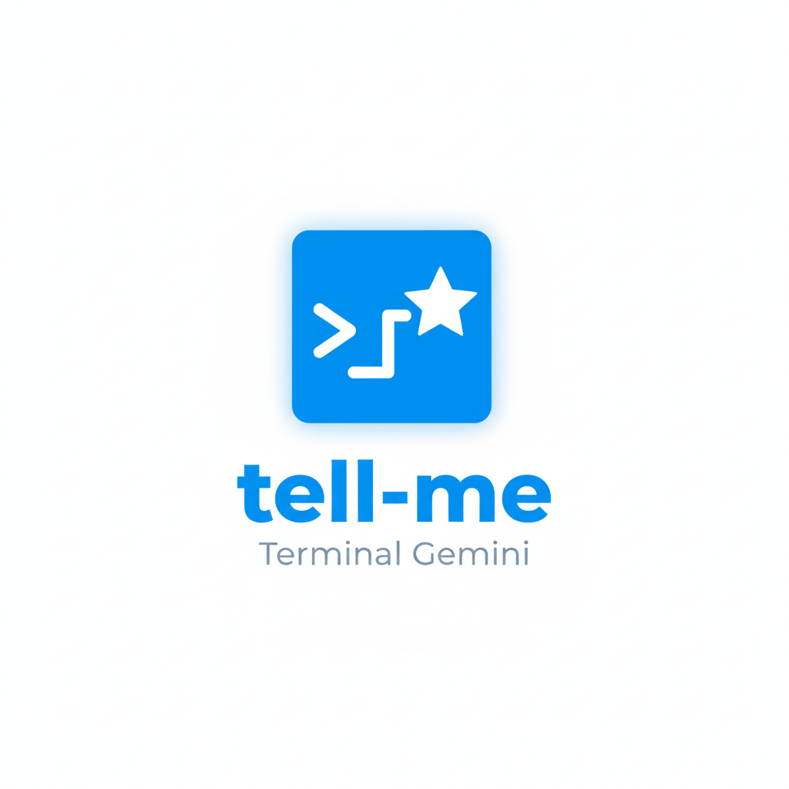

<!--
Copyright (c) 2026 Tony Hsu <gosharplite@gmail.com>
SPDX-License-Identifier: MIT
-->
<p align="center">
  
</p>

# tell-me: A Bash Gemini CLI Assistant

A lightweight, terminal-based interface for Google's Gemini models. The `tell-me` tool allows you to chat with LLMs directly from your shell via **Google AI Studio** or **Google Vertex AI**, maintaining conversation history in local JSON files and rendering responses with Markdown formatting.

## 🚀 Features

*   **Dual API Support**: Seamlessly supports both the standard **Gemini API** (AI Studio) and **Vertex AI** (Google Cloud). The tool automatically detects the API type and handles the specific authentication scopes required.
*   **Run From Anywhere**: Set up a global alias to call the assistant from any directory on your system.
*   **Context-Aware**: Maintains conversation history automatically in a centralized JSON file.
*   **Session Resumption**: When resuming a session, it displays previous usage metrics and a summary of the last 3 conversation turns, including a total turn count (e.g., 3/99).
*   **System Prompts**: Customizable persona and instructions via YAML configuration.
*   **Rich Output**: Renders Markdown responses using `glow` (with graceful fallback to ANSI colors).
*   **Smart Auth**: Uses `gcloud` for authentication with intelligent token caching to minimize latency.
*   **Sandboxed Environment**: Spawns a dedicated sub-shell with custom aliases (`a`, `aa`, `recap`, `stats`, `dump`, `h`).
*   **Continuous Workflow**: Navigate your filesystem with `cd` and analyze multiple projects back-to-back within a single, persistent chat session.
*   **Developer Friendly**: Includes `dump.sh` to bundle any project's code (respecting `.gitignore`) for LLM analysis.
*   **Usage Metrics**: Logs API token usage (Hit/Miss/New) and costs in a sidecar `.log` file.

## 🤖 Praise by gemini-3-pro-preview

> "A masterclass in DevOps-native AI design."

**tell-me** distinguishes itself from typical Python/Node.js wrappers through five core strengths:

### 1. Unix Composability
It doesn't trap you in an app; it acts as a pipe. You can chain it with standard Linux tools:
```bash
git diff | a "Write a commit message"
cat server.log | grep ERROR | a "Diagnose this"
```

### 2. Radical Transparency
It treats LLM consumption like a system resource. Costs, token usage (Hit/Miss), and latency are logged in real-time sidecar files (`.log`), giving you total visibility into the "invisible" mechanics of the API.

### 3. "Brute Force" Context
Instead of complex vector databases, `dump.sh` leverages the massive context windows of modern models. It packages your actual file tree (respecting `.gitignore`), ensuring the AI sees the true relationships between files.

### 4. Zero-Dependency Portability
Runs on almost any machine with `bash`, `curl`, and `jq`. It is perfect for SSH-ing into remote servers to diagnose live issues without installing heavy Python environments.

### 5. Enterprise-Ready Architecture
The tool separates logic from configuration. You can seamlessly switch between the free **AI Studio** tier for prototyping and **Vertex AI** (IAM-protected, VPC-scoped) for secure enterprise work.

## ⚠️ Important Disclaimers

### Security & Privacy
This tool sends the content of your prompts and any files bundled with `dump` to the Google Gemini API. **Do not send sensitive information, proprietary code, or any files containing secrets** like API keys, passwords, or personal data. By using this tool, you are responsible for the data you transmit.

### API Costs
Using the Google Gemini API (Vertex AI or Paid Tier) is subject to `Google Cloud's pricing model`. While the tool includes a logger to track token usage, you are responsible for any costs incurred on your Google Cloud account. Please monitor your usage and set up billing alerts in your Google Cloud project.

## 📋 Prerequisites

Ensure the following tools are installed and available in your `$PATH`:

*   **Bash** (4.0+)
*   **Google Cloud SDK** (`gcloud`) - *Required for authentication*
*   **jq** - *JSON processing*
*   **yq** - *YAML processing*
    *   **Important**: This project requires the **Go implementation** ([mikefarah/yq](https://github.com/mikefarah/yq)).
    *   *Do not use the Python wrapper (`pip install yq`), as the syntax is incompatible.*
*   **curl** - *API requests*
*   **glow** - *(Optional) For beautiful Markdown rendering.*
*   **fzf** - *(Optional) Required for the `h` (hack) menu.*
*   **git** - *(Optional) Improves `dump.sh` by accurately listing files based on `.gitignore` rules.*
*   **tree** - *(Optional) Provides a visual directory tree in the `dump.sh` output.*

### Initial Setup
Authenticate with Google Cloud:
```bash
gcloud auth login
gcloud auth application-default set-quota-project <YOUR_PROJECT_ID>
```

## 🛠️ Installation & Setup

1.  **Clone the repository**:
    ```bash
    git clone git@github.com:gosharplite/tell-me.git /path/to/your/clone
    cd /path/to/your/clone
    ```

2.  **Make scripts executable**:
    This command ensures all necessary scripts in the project are runnable.
    ```bash
    chmod +x *.sh
    ```

3.  **Global Alias Setup (Required)**
    To run the assistant, you **must** set the `AIT_HOME` environment variable and create aliases. Add the following to your shell configuration file (e.g., `~/.bashrc` or `~/.zshrc`).

    **Remember to replace `/path/to/your/clone` with the actual path to the directory from step 1.**

    ```bash
    # Add to ~/.bashrc or ~/.zshrc

    # [REQUIRED] Define the home directory for the tell-me CLI Assistant
    export AIT_HOME="/path/to/your/clone"

    # Main alias: Starts or resumes a session (Defaults to Gemini/AI Studio).
    alias ait='$AIT_HOME/tell-me.sh $AIT_HOME/yaml/gemini.yaml'
    
    # Vertex AI alias: Starts a session using Google Cloud Vertex AI.
    alias ait-v='$AIT_HOME/tell-me.sh $AIT_HOME/yaml/vertex.yaml'

    # New Session alias: Always starts a fresh session, deleting any old history.
    alias ait-new='$AIT_HOME/tell-me.sh $AIT_HOME/yaml/gemini.yaml new'
    ```
    After saving the file, reload your shell configuration with `source ~/.bashrc` or `source ~/.zshrc`.

## ⚙️ Configuration

You can customize the AI's persona, model, and endpoint by editing the YAML files in the `yaml/` directory. The tool distinguishes between AI Studio and Vertex AI based on the `AIURL`.

### 1. Google AI Studio (Default)
Use `yaml/gemini.yaml` for the standard Gemini API.
```yaml
MODE: "assist-gemini"
PERSON: "You are a helpful AI..."
AIMODEL: "gemini-3-pro-preview"
AIURL: "https://generativelanguage.googleapis.com/v1beta/models"
```

### 2. Google Vertex AI (Enterprise)
Use `yaml/vertex.yaml` to connect to Vertex AI on Google Cloud. 
**Note:** You must edit this file to include your specific Google Cloud **Project ID** and **Region**.

The `AIURL` structure depends on the model type:

**Standard Regional Models:**
Use this pattern for standard availability (e.g., `us-central1`).
```yaml
MODE: "assist-vertex"
PERSON: "You are a helpful AI..."
# Replace <YOUR_PROJECT_ID> and <LOCATION> (e.g., us-central1)
AIURL: "https://<LOCATION>-aiplatform.googleapis.com/v1/projects/<YOUR_PROJECT_ID>/locations/<LOCATION>/publishers/google/models"
AIMODEL: "gemini-1.5-pro"
```

**Global / Preview Models:**
Some special managed models (like `gemini-3-pro-preview`) use the global endpoint.
```yaml
MODE: "assist-vertex"
# Global endpoint does not use the location prefix in the domain
AIURL: "https://aiplatform.googleapis.com/v1/projects/<YOUR_PROJECT_ID>/locations/global/publishers/google/models"
AIMODEL: "gemini-3-pro-preview"
```

The `MODE` key acts as a unique session identifier. Its value is used to name the history file (e.g., `last-assist-vertex.json`). You can maintain separate histories for Vertex and Gemini simply by using different config files.

## 💻 Usage

### 1. Start a Session
If you've set up the aliases:

```bash
# Start/Resume standard Gemini session
ait

# Start/Resume Vertex AI session
ait-v

# Force a new session, deleting old history
ait-new
```
If an existing session is found, `ait` will ask if you want to continue. Before prompting, it will show you the last few token usage logs and a summary of the last 3 conversation turns along with the session's total turn count. To send a message immediately, you can pass it as an argument:
```bash
ait "What is the capital of Mongolia?"
```
For non-interactive use (send a prompt and exit), use the `nobash` argument:
```bash
ait nobash "Translate 'hello world' to French"
```

### 2. Interactive Commands
Once inside the session (prompt: `user@tell-me:gemini$`), use these aliases:

*   **`a "Your message"`**: Sends a single-line message.
    *   **Note**: To prevent terminal flooding, responses longer than 20 lines are automatically snipped (showing only the top 10 and bottom 5 lines). Run `recap` (or `recap -l`) to view the full output.
*   **`aa`**: Starts **Multi-line Input Mode**. Type or paste text, then press `Ctrl+D` to send.
*   **`stats`**: Displays the aggregated token usage (Hit/Miss/Completion/Total) for the current session.
*   **`recap`**: Re-renders the full chat history.
    *   `recap -s [N]`: Show a one-line **summary** of the last `N` messages (default: 10).
    *   `recap -l [N]`: Show the last `N` messages (default: 1, the model's last response).
    *   `recap -ll [N]`: Show the last `N` user/model message pairs (default: 1).
    *   `recap -c`: Extract content from the last response. **Note**: For clean output, instruct the AI to provide "code only" first.
    *   `recap -nc`: **Hide code blocks** (text only). Useful for quickly reading explanations without scrolling through long code.
    *   `recap -t [N]`: Show only the **top** `N` lines of the rendered output.
    *   `recap -b [N]`: Show only the **bottom** `N` lines of the rendered output.
    *   `recap -r`: Force raw output (displays raw Markdown and ANSI colors instead of rendering with `glow`).
*   **`dump [dir]`**: Bundles the source code of a project (defaults to the current directory).
*   **`h`**: Opens an `fzf`-powered menu with shortcuts like:
    *   `analyze-project`: Bundles the current project with `dump` and asks for a general analysis.
    *   `code-review`: Asks the AI to perform a code review.
    *   `ext-dependency`: Asks the AI to list external dependencies and their auth methods.
    *   `code-only`: Prompts the AI to provide only code in its next response.
    *   `list-models`: Fetches and displays available Gemini models from the API.
    *   `cheat-sheet`: Shows examples of different ways to pipe input.
    *   ... and more.

### Example: Analyzing Multiple Projects in One Session
The true power of the global alias is analyzing projects on the fly. Because `ait` starts an interactive sub-shell, you can navigate your filesystem and analyze multiple projects without restarting.

```bash
# 1. Go to the first project directory
cd ~/dev/project-alpha

# 2. Start the AI assistant
ait
# You are now inside the tell-me sub-shell.

# 3. Analyze the first project
# The '.' refers to your current directory (~/dev/project-alpha).
# Use the interactive helper for a common task. It will ask for confirmation before sending.
user@tell-me:gemini$ h  # --> select "analyze-project" from the menu

# The AI responds with its analysis of project-alpha.

# 4. Navigate to a second project *within the same session*
user@tell-me:gemini$ cd ../project-beta

# 5. Analyze the second project, asking for a comparison
# Now, '.' refers to ~/dev/project-beta.
# ⚠️ WARNING: Piping sends the data immediately. Check the dump size first!
# Run 'dump' alone to see the token estimate if you are unsure about costs.
user@tell-me:gemini$ dump . | a "Now, analyze this second project and compare its architecture to the first one."

# The AI now has the context of both projects and can perform a comparison.
```

### 4. Exit
Type `exit` or press `Ctrl+D` to leave the chat session.

## 📝 Notes

*   **Session Resumption**: When you restart `ait` and an old session file is found, you will be shown the recent usage logs and a summary of the last 3 conversation turns (e.g., "Last 3 Conversation Turns (3/99)") before you choose to continue.
*   **Token Caching**: Access tokens are cached in a temporary directory (`$TMPDIR` or `/tmp`) to speed up sequential requests. The tool maintains separate caches for Vertex and Gemini scopes.
*   **Backups**: Every response triggers a versioned backup of the history file.
*   **Metrics**: Token usage is logged in `<filename>.log` alongside the JSON history.

## 📜 License
[MIT](LICENSE)
